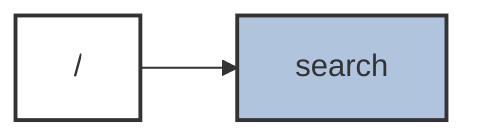

# Web Search Client

OpenAPI: https://raw.githubusercontent.com/Azure/azure-rest-api-specs/main/specification/cognitiveservices/data-plane/WebSearch/stable/v1.0/WebSearch.json

GET
POST
GET POST
GET PATCH DELETE
GET PUT DELETE
GET DELETE
DELETE

