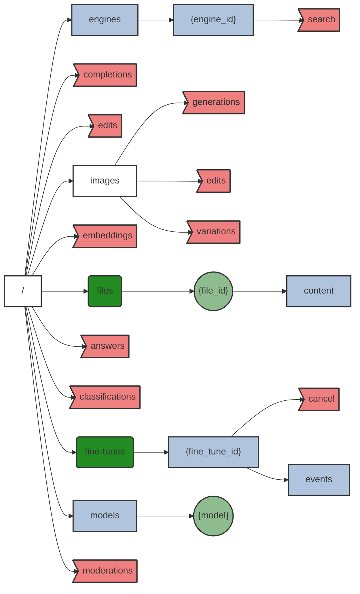

# OpenAI API

OpenAPI: https://raw.githubusercontent.com/openai/openai-openapi/master/openapi.yaml

GET
POST
GET POST
DELETE GET PATCH
DELETE GET PATCH PUT
DELETE GET PUT
DELETE GET
DELETE
OTHER

```mermaid
graph LR
classDef GET fill:lightSteelBlue,stroke:#333,stroke-width:2px
classDef POST fill:Lightcoral,stroke:#333,stroke-width:2px
classDef GET_POST fill:forestGreen,stroke:#333,stroke-width:2px
classDef DELETE_GET_PATCH fill:yellowGreen,stroke:#333,stroke-width:2px
classDef DELETE_GET_PATCH_PUT fill:oliveDrab,stroke:#333,stroke-width:2px
classDef DELETE_GET_PUT fill:olive,stroke:#333,stroke-width:2px
classDef DELETE_GET fill:DarkSeaGreen,stroke:#333,stroke-width:2px
classDef DELETE fill:Tomato,stroke:#333,stroke-width:2px
classDef OTHER fill:White,stroke:#333,stroke-width:2px
/["/"] --> /engines["engines"]
/engines["engines"] --> /engines/:engine_id["{engine_id}"]
/engines/:engine_id["{engine_id}"] --> /engines/:engine_id/search>"search"]
class /engines/:engine_id/search POST
class /engines/:engine_id GET
class /engines GET
/["/"] --> /completions>"completions"]
class /completions POST
/["/"] --> /edits>"edits"]
class /edits POST
/["/"] --> /images["images"]
/images["images"] --> /images/generations>"generations"]
class /images/generations POST
/images["images"] --> /images/edits>"edits"]
class /images/edits POST
/images["images"] --> /images/variations>"variations"]
class /images/variations POST
class /images OTHER
/["/"] --> /embeddings>"embeddings"]
class /embeddings POST
/["/"] --> /files("files")
/files("files") --> /files/:file_id(("{file_id}"))
/files/:file_id(("{file_id}")) --> /files/:file_id/content["content"]
class /files/:file_id/content GET
class /files/:file_id DELETE_GET
class /files GET_POST
/["/"] --> /answers>"answers"]
class /answers POST
/["/"] --> /classifications>"classifications"]
class /classifications POST
/["/"] --> /fine_tunes("fine-tunes")
/fine_tunes("fine-tunes") --> /fine_tunes/:fine_tune_id["{fine_tune_id}"]
/fine_tunes/:fine_tune_id["{fine_tune_id}"] --> /fine_tunes/:fine_tune_id/cancel>"cancel"]
class /fine_tunes/:fine_tune_id/cancel POST
/fine_tunes/:fine_tune_id["{fine_tune_id}"] --> /fine_tunes/:fine_tune_id/events["events"]
class /fine_tunes/:fine_tune_id/events GET
class /fine_tunes/:fine_tune_id GET
class /fine_tunes GET_POST
/["/"] --> /models["models"]
/models["models"] --> /models/:model(("{model}"))
class /models/:model DELETE_GET
class /models GET
/["/"] --> /moderations>"moderations"]
class /moderations POST
class / OTHER
```
