```mermaid
graph LR
classDef GET fill:lightSteelBlue,stroke:#333,stroke-width:2px;
classDef POST fill:SteelBlue,stroke:#333,stroke-width:2px;
classDef GETPOST fill:forestGreen,stroke:#333,stroke-width:2px;
classDef DELETEGETPATCH fill:yellowGreen,stroke:#333,stroke-width:2px;
classDef DELETEGETPUT fill:olive,stroke:#333,stroke-width:2px;
classDef DELETEGET fill:DarkSeaGreen,stroke:#333,stroke-width:2px;
classDef DELETE fill:tomato,stroke:#333,stroke-width:2px;
classDef OTHER fill:white,stroke:#333,stroke-width:2px;
/ --> /accounts[accounts]
/accounts --> /accounts/balance[balance]
/accounts/balance --> /accounts/balance/get[get]
class /accounts/balance/get POST
class /accounts/balance OTHER
/accounts --> /accounts/get[get]
class /accounts/get POST
class /accounts OTHER
/ --> /application[application]
/application --> /application/get[get]
class /application/get POST
class /application OTHER
/ --> /asset_report[asset_report]
/asset_report --> /asset_report/audit_copy[audit_copy]
/asset_report/audit_copy --> /asset_report/audit_copy/create[create]
class /asset_report/audit_copy/create POST
/asset_report/audit_copy --> /asset_report/audit_copy/get[get]
class /asset_report/audit_copy/get POST
/asset_report/audit_copy --> /asset_report/audit_copy/remove[remove]
class /asset_report/audit_copy/remove POST
class /asset_report/audit_copy OTHER
/asset_report --> /asset_report/create[create]
class /asset_report/create POST
/asset_report --> /asset_report/filter[filter]
class /asset_report/filter POST
/asset_report --> /asset_report/get[get]
class /asset_report/get POST
/asset_report --> /asset_report/pdf[pdf]
/asset_report/pdf --> /asset_report/pdf/get[get]
class /asset_report/pdf/get POST
class /asset_report/pdf OTHER
/asset_report --> /asset_report/refresh[refresh]
class /asset_report/refresh POST
/asset_report --> /asset_report/remove[remove]
class /asset_report/remove POST
class /asset_report OTHER
/ --> /auth[auth]
/auth --> /auth/get[get]
class /auth/get POST
class /auth OTHER
/ --> /bank_transfer[bank_transfer]
/bank_transfer --> /bank_transfer/balance[balance]
/bank_transfer/balance --> /bank_transfer/balance/get[get]
class /bank_transfer/balance/get POST
class /bank_transfer/balance OTHER
/bank_transfer --> /bank_transfer/cancel[cancel]
class /bank_transfer/cancel POST
/bank_transfer --> /bank_transfer/create[create]
class /bank_transfer/create POST
/bank_transfer --> /bank_transfer/event[event]
/bank_transfer/event --> /bank_transfer/event/list[list]
class /bank_transfer/event/list POST
/bank_transfer/event --> /bank_transfer/event/sync[sync]
class /bank_transfer/event/sync POST
class /bank_transfer/event OTHER
/bank_transfer --> /bank_transfer/get[get]
class /bank_transfer/get POST
/bank_transfer --> /bank_transfer/list[list]
class /bank_transfer/list POST
/bank_transfer --> /bank_transfer/migrate_account[migrate_account]
class /bank_transfer/migrate_account POST
class /bank_transfer OTHER
/ --> /categories[categories]
/categories --> /categories/get[get]
class /categories/get POST
class /categories OTHER
/ --> /deposit_switch[deposit_switch]
/deposit_switch --> /deposit_switch/alt[alt]
/deposit_switch/alt --> /deposit_switch/alt/create[create]
class /deposit_switch/alt/create POST
class /deposit_switch/alt OTHER
/deposit_switch --> /deposit_switch/create[create]
class /deposit_switch/create POST
/deposit_switch --> /deposit_switch/get[get]
class /deposit_switch/get POST
/deposit_switch --> /deposit_switch/token[token]
/deposit_switch/token --> /deposit_switch/token/create[create]
class /deposit_switch/token/create POST
class /deposit_switch/token OTHER
class /deposit_switch OTHER
/ --> /employers[employers]
/employers --> /employers/search[search]
class /employers/search POST
class /employers OTHER
/ --> /identity[identity]
/identity --> /identity/get[get]
class /identity/get POST
class /identity OTHER
/ --> /income[income]
/income --> /income/verification[verification]
/income/verification --> /income/verification/create[create]
class /income/verification/create POST
/income/verification --> /income/verification/documents[documents]
/income/verification/documents --> /income/verification/documents/download[download]
class /income/verification/documents/download POST
class /income/verification/documents OTHER
/income/verification --> /income/verification/paystubs[paystubs]
/income/verification/paystubs --> /income/verification/paystubs/get[get]
class /income/verification/paystubs/get POST
class /income/verification/paystubs OTHER
/income/verification --> /income/verification/refresh[refresh]
class /income/verification/refresh POST
/income/verification --> /income/verification/summary[summary]
/income/verification/summary --> /income/verification/summary/get[get]
class /income/verification/summary/get POST
class /income/verification/summary OTHER
class /income/verification OTHER
class /income OTHER
/ --> /institutions[institutions]
/institutions --> /institutions/get[get]
class /institutions/get POST
/institutions --> /institutions/get_by_id[get_by_id]
class /institutions/get_by_id POST
/institutions --> /institutions/search[search]
class /institutions/search POST
class /institutions OTHER
/ --> /investments[investments]
/investments --> /investments/holdings[holdings]
/investments/holdings --> /investments/holdings/get[get]
class /investments/holdings/get POST
class /investments/holdings OTHER
/investments --> /investments/transactions[transactions]
/investments/transactions --> /investments/transactions/get[get]
class /investments/transactions/get POST
class /investments/transactions OTHER
class /investments OTHER
/ --> /item[item]
/item --> /item/access_token[access_token]
/item/access_token --> /item/access_token/invalidate[invalidate]
class /item/access_token/invalidate POST
class /item/access_token OTHER
/item --> /item/application[application]
/item/application --> /item/application/list[list]
class /item/application/list POST
/item/application --> /item/application/scopes[scopes]
/item/application/scopes --> /item/application/scopes/update[update]
class /item/application/scopes/update POST
class /item/application/scopes OTHER
class /item/application OTHER
/item --> /item/get[get]
class /item/get POST
/item --> /item/import[import]
class /item/import POST
/item --> /item/public_token[public_token]
/item/public_token --> /item/public_token/create[create]
class /item/public_token/create POST
/item/public_token --> /item/public_token/exchange[exchange]
class /item/public_token/exchange POST
class /item/public_token OTHER
/item --> /item/remove[remove]
class /item/remove POST
/item --> /item/webhook[webhook]
/item/webhook --> /item/webhook/update[update]
class /item/webhook/update POST
class /item/webhook OTHER
class /item OTHER
/ --> /liabilities[liabilities]
/liabilities --> /liabilities/get[get]
class /liabilities/get POST
class /liabilities OTHER
/ --> /link[link]
/link --> /link/token[token]
/link/token --> /link/token/create[create]
class /link/token/create POST
/link/token --> /link/token/get[get]
class /link/token/get POST
class /link/token OTHER
class /link OTHER
/ --> /payment_initiation[payment_initiation]
/payment_initiation --> /payment_initiation/payment[payment]
/payment_initiation/payment --> /payment_initiation/payment/create[create]
class /payment_initiation/payment/create POST
/payment_initiation/payment --> /payment_initiation/payment/get[get]
class /payment_initiation/payment/get POST
/payment_initiation/payment --> /payment_initiation/payment/list[list]
class /payment_initiation/payment/list POST
/payment_initiation/payment --> /payment_initiation/payment/token[token]
/payment_initiation/payment/token --> /payment_initiation/payment/token/create[create]
class /payment_initiation/payment/token/create POST
class /payment_initiation/payment/token OTHER
class /payment_initiation/payment OTHER
/payment_initiation --> /payment_initiation/recipient[recipient]
/payment_initiation/recipient --> /payment_initiation/recipient/create[create]
class /payment_initiation/recipient/create POST
/payment_initiation/recipient --> /payment_initiation/recipient/get[get]
class /payment_initiation/recipient/get POST
/payment_initiation/recipient --> /payment_initiation/recipient/list[list]
class /payment_initiation/recipient/list POST
class /payment_initiation/recipient OTHER
class /payment_initiation OTHER
/ --> /processor[processor]
/processor --> /processor/apex[apex]
/processor/apex --> /processor/apex/processor_token[processor_token]
/processor/apex/processor_token --> /processor/apex/processor_token/create[create]
class /processor/apex/processor_token/create POST
class /processor/apex/processor_token OTHER
class /processor/apex OTHER
/processor --> /processor/auth[auth]
/processor/auth --> /processor/auth/get[get]
class /processor/auth/get POST
class /processor/auth OTHER
/processor --> /processor/balance[balance]
/processor/balance --> /processor/balance/get[get]
class /processor/balance/get POST
class /processor/balance OTHER
/processor --> /processor/bank_transfer[bank_transfer]
/processor/bank_transfer --> /processor/bank_transfer/create[create]
class /processor/bank_transfer/create POST
class /processor/bank_transfer OTHER
/processor --> /processor/identity[identity]
/processor/identity --> /processor/identity/get[get]
class /processor/identity/get POST
class /processor/identity OTHER
/processor --> /processor/stripe[stripe]
/processor/stripe --> /processor/stripe/bank_account_token[bank_account_token]
/processor/stripe/bank_account_token --> /processor/stripe/bank_account_token/create[create]
class /processor/stripe/bank_account_token/create POST
class /processor/stripe/bank_account_token OTHER
class /processor/stripe OTHER
/processor --> /processor/token[token]
/processor/token --> /processor/token/create[create]
class /processor/token/create POST
class /processor/token OTHER
class /processor OTHER
/ --> /sandbox[sandbox]
/sandbox --> /sandbox/bank_transfer[bank_transfer]
/sandbox/bank_transfer --> /sandbox/bank_transfer/fire_webhook[fire_webhook]
class /sandbox/bank_transfer/fire_webhook POST
/sandbox/bank_transfer --> /sandbox/bank_transfer/simulate[simulate]
class /sandbox/bank_transfer/simulate POST
class /sandbox/bank_transfer OTHER
/sandbox --> /sandbox/income[income]
/sandbox/income --> /sandbox/income/fire_webhook[fire_webhook]
class /sandbox/income/fire_webhook POST
class /sandbox/income OTHER
/sandbox --> /sandbox/item[item]
/sandbox/item --> /sandbox/item/fire_webhook[fire_webhook]
class /sandbox/item/fire_webhook POST
/sandbox/item --> /sandbox/item/reset_login[reset_login]
class /sandbox/item/reset_login POST
/sandbox/item --> /sandbox/item/set_verification_status[set_verification_status]
class /sandbox/item/set_verification_status POST
class /sandbox/item OTHER
/sandbox --> /sandbox/oauth[oauth]
/sandbox/oauth --> /sandbox/oauth/select_accounts[select_accounts]
class /sandbox/oauth/select_accounts POST
class /sandbox/oauth OTHER
/sandbox --> /sandbox/processor_token[processor_token]
/sandbox/processor_token --> /sandbox/processor_token/create[create]
class /sandbox/processor_token/create POST
class /sandbox/processor_token OTHER
/sandbox --> /sandbox/public_token[public_token]
/sandbox/public_token --> /sandbox/public_token/create[create]
class /sandbox/public_token/create POST
class /sandbox/public_token OTHER
class /sandbox OTHER
/ --> /signal[signal]
/signal --> /signal/decision[decision]
/signal/decision --> /signal/decision/report[report]
class /signal/decision/report POST
class /signal/decision OTHER
/signal --> /signal/evaluate[evaluate]
class /signal/evaluate POST
/signal --> /signal/return[return]
/signal/return --> /signal/return/report[report]
class /signal/return/report POST
class /signal/return OTHER
class /signal OTHER
/ --> /transactions[transactions]
/transactions --> /transactions/get[get]
class /transactions/get POST
/transactions --> /transactions/refresh[refresh]
class /transactions/refresh POST
class /transactions OTHER
/ --> /webhook_verification_key[webhook_verification_key]
/webhook_verification_key --> /webhook_verification_key/get[get]
class /webhook_verification_key/get POST
class /webhook_verification_key OTHER
class / OTHER
```

# The Plaid API

OpenAPI: https://api.apis.guru/v2/specs/plaid.com/2020-09-14_1.20.6/openapi.json

<svg fill="none" viewBox="0 0 120 120" width="120" height="120" xmlns="http://www.w3.org/2000/svg">
  <foreignObject width="100%" height="100%">
    

      
      <h1>Hello, world</h1>
    

  </foreignObject>
</svg>

<svg fill="none" viewBox="0 0 120 120" width="120" height="120" xmlns="http://www.w3.org/2000/svg">
  <foreignObject width="100%" height="100%">
    

      GET
      POST
      GET POST
      GET PATCH DELETE
      GET PUT DELETE
      GET DELETE
      DELETE
    

   </foreignObject>
</svg>

