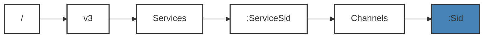

```mermaid
graph LR
classDef GET fill:lightSteelBlue,stroke:#333,stroke-width:2px;
classDef POST fill:SteelBlue,stroke:#333,stroke-width:2px;
classDef GETPOST fill:forestGreen,stroke:#333,stroke-width:2px;
classDef DELETEGETPATCH fill:yellowGreen,stroke:#333,stroke-width:2px;
classDef DELETEGETPUT fill:olive,stroke:#333,stroke-width:2px;
classDef DELETEGET fill:DarkSeaGreen,stroke:#333,stroke-width:2px;
classDef DELETE fill:tomato,stroke:#333,stroke-width:2px;
classDef OTHER fill:white,stroke:#333,stroke-width:2px;
/ --> /v3[v3]
/v3 --> /v3/Services[Services]
/v3/Services --> /v3/Services/:ServiceSid[:ServiceSid]
/v3/Services/:ServiceSid --> /v3/Services/:ServiceSid/Channels[Channels]
/v3/Services/:ServiceSid/Channels --> /v3/Services/:ServiceSid/Channels/:Sid[:Sid]
class /v3/Services/:ServiceSid/Channels/:Sid POST
class /v3/Services/:ServiceSid/Channels OTHER
class /v3/Services/:ServiceSid OTHER
class /v3/Services OTHER
class /v3 OTHER
class / OTHER
```
